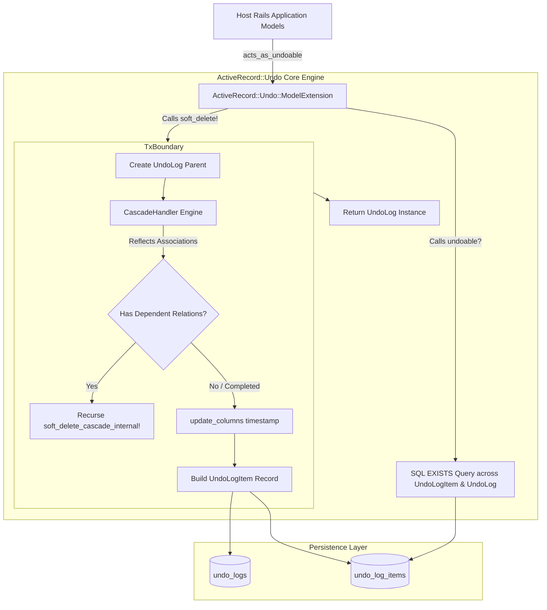
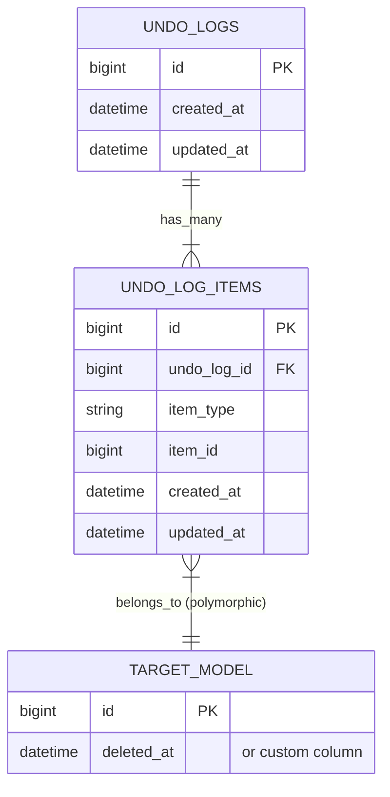
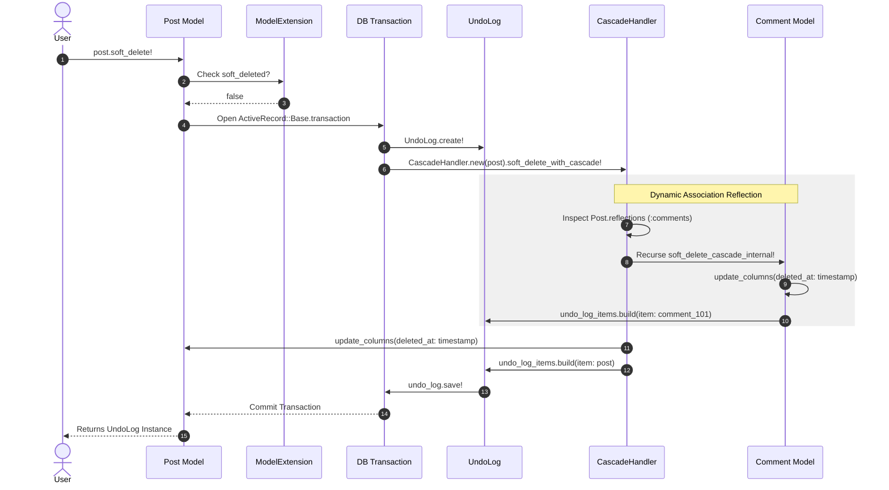
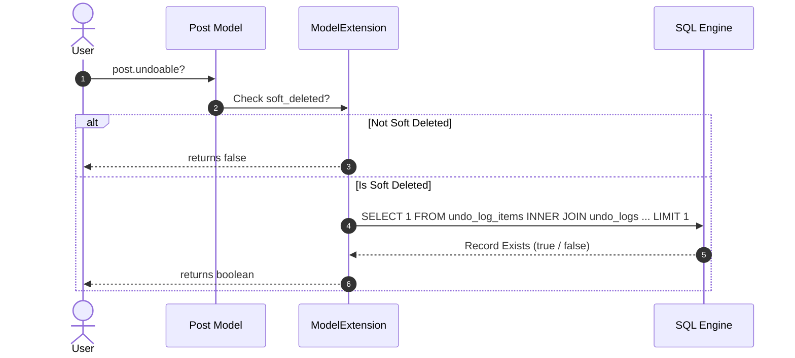
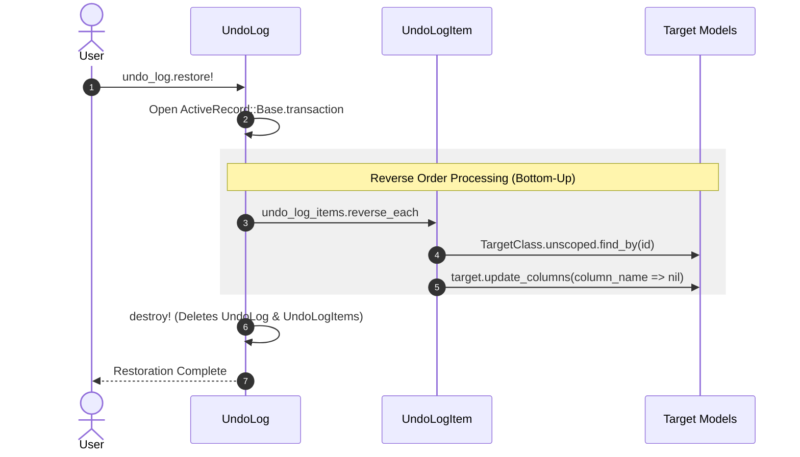

# ActiveRecord::Undo Architecture & Technical Documentation

`ActiveRecord::Undo` is a Rails Engine gem providing transactional, cascade-aware soft deletion and restoration capabilities for ActiveRecord models. It records state transitions into a dedicated polymorphic audit structure within single database transactions.

---

## 1. System Architecture Overview

---

## 2. Core Components & Responsibilities

### Component Summary

| Component | File Path | Class / Module | Core Responsibility |
| :--- | :--- | :--- | :--- |
| **Main Hook** | `lib/active_record/undo.rb` | `ActiveRecord::Undo` | Hooks into `ActiveSupport.on_load(:active_record)` |
| **Model Extension** | `lib/active_record/undo/model_extension.rb` | `ModelExtension` | Injects DSL (`acts_as_undoable`), scopes (`kept`, `soft_deleted`), and methods (`soft_delete!`, `undoable?`, `restore!`) |
| **Cascade Engine** | `lib/active_record/undo/cascade_handler.rb` | `CascadeHandler` | Inspects ActiveRecord reflections (`reflections`) and executes DFS traversal |
| **Cascade Association Finder** | `lib/active_record/undo/cascade_handler/association_finder.rb` | `AssociationFinder` | Resolves which records should cascade based on dependency configuration |
| **Cascade Record Updater** | `lib/active_record/undo/cascade_handler/record_updater.rb` | `RecordUpdater` | Updates the database timestamps directly bypassing callbacks |
| **Audit Log Parent** | `lib/active_record/undo/undo_log.rb` | `UndoLog` | Represents the top-level deletion event and manages atomic batch restoration |
| **Audit Log Child** | `lib/active_record/undo/undo_log_item.rb` | `UndoLogItem` | Maps polymorphic targets (`item_type`, `item_id`) to original deleted entities |
| **Engine Link** | `lib/active_record/undo/engine.rb` | `Engine` | Appends `db/migrate/` directly to host app migration paths |
| **Configuration** | `lib/active_record/undo/configuration.rb` | `Configuration` | Houses retention_period settings |
| **Purger Service** | `lib/active_record/undo/purger.rb` | `Purger` | Deletes expired UndoLog/Items and soft-deleted model records in batches |
| **Purge Job** | `lib/active_record/undo/purge_job.rb` | `PurgeJob` | ActiveJob background runner invoking Purger |
| **Rake Task** | `lib/active_record/undo/tasks/purge.rake` | Rake Task | Exposes `active_record_undo:purge_expired` command |

---

## 3. Data Model & Database Design

---

## 4. Sequence Diagrams

### Soft Deletion Flow (`#soft_delete!`)

### Restoration Verification Flow (`#undoable?`)

### Restoration Flow (`#restore!`)

---

## 5. Key Technical Considerations

1. **Depth-First Traversal Order:** Cascading deletes traverse downward to child records before updating the parent node. Child item associations are appended to `undo_log_items` first, and the parent record is appended last.
2. **Reverse Restoration Order:** `#restore!` calls `undo_log_items.reverse_each`. This ensures the parent node is restored first before restoring its dependent records, maintaining database relational integrity.
3. **Optimized `#undoable?` Query Execution:** Calling `#undoable?` executes a single optimized `EXISTS` query (`joins(:undo_log).exists?(item_type: self.class.name, item_id: id)`). This checks for the presence of both the audit item and the valid parent log without loading records into Ruby memory.
4. **Bypassing Callbacks:** Soft-deletion updates use `update_columns`. This executes a direct SQL `UPDATE` query without firing standard ActiveRecord persistence callbacks (`save`, `validate`), preventing unintended side effects during soft deletes.
5. **Unscoped Model Resolution:** `#restore_item!` uses `klass.unscoped.find_by(id: item_id)` to locate records. This guarantees records are retrieved even when models define default scopes that filter out soft-deleted records.
6. **Class Inheritance Security Check:** When constantizing stored class strings, the gem validates that target models inherit from `ActiveRecord::Base` to prevent arbitrary non-model constant manipulation.

---

## 6. Method-by-Method Implementation Reference

### 6.1 `lib/active_record/undo.rb` (Entrypoint)

* **`require 'active_record'` Loader Check**
  - *Function*: Safely imports ActiveRecord. If ActiveRecord is not in the load path, it catches the `LoadError` and throws a detailed error instructing the developer to add `activerecord` to their `Gemfile`.
* **Loader Hook Block**
  - *Function*: Detects if `ActiveSupport` is loaded:
    - If present, registers `ActiveSupport.on_load(:active_record)` to inject the extension module when ActiveRecord boots.
    - If absent (e.g. running in simple Ruby scripts), directly includes `ModelExtension` into `ActiveRecord::Base` as a fallback.

### 6.2 `lib/active_record/undo/engine.rb` (Rails Integration)

* **`initializer 'active_record_undo.migrations'`**
  - *Function*: Automatically runs on Rails boot to append the gem's engine migrations directory to the host application's migrations search paths. This allows host applications to detect and run gem database migrations without needing to manually copy them into the application's workspace.

### 6.3 `lib/active_record/undo/model_extension.rb` (Model Extension Module)

* **`acts_as_undoable(column: :deleted_at)`**
  - *Function*: Class-level DSL macro injected into models to enable soft-deletion.
  - *Details*: Defines class-level configurations:
    - `undoable_column`: Caches the name of the column (defaults to `:deleted_at`).
    - `kept` scope: Returns records that are not soft-deleted (`where(column => nil)`).
    - `soft_deleted` scope: Returns records that are soft-deleted (`where.not(column => nil)`).
    - `expired` scope: Returns records soft-deleted before the global retention period threshold.
* **`soft_deleted?`**
  - *Function*: Checks if the current record instance has been soft-deleted. Returns `true` if the configured deletion column is populated with a timestamp.
* **`undoable?`**
  - *Function*: Checks if the soft-deleted record has a valid undo log entry available for restoration.
  - *Steps*:
    1. Returns `false` immediately if `soft_deleted?` is `false`.
    2. Performs a lightweight SQL `EXISTS` query (`ActiveRecord::Undo::UndoLogItem.joins(:undo_log).exists?(item_type: self.class.name, item_id: id)`).
    3. Returns `true` if both the log item and its parent `UndoLog` exist in the database.
* **`soft_delete!`**
  - *Function*: Starts the cascade soft-deletion sequence for the record.
  - *Steps*:
    1. Calls `ensure_undoable_column_exists!` to verify the database column is present.
    2. Aborts and returns `false` if the record is already soft-deleted.
    3. Opens an ActiveRecord database transaction block.
    4. Creates a new parent `UndoLog` object.
    5. Recursively invokes cascading soft-deletes on associations and marks the record itself as soft-deleted via `CascadeHandler`.
    6. Saves the transaction and returns the constructed `UndoLog`.
* **`restore!`**
  - *Function*: Restores the record from its soft-deleted state.
  - *Steps*:
    1. Verifies column presence via `ensure_undoable_column_exists!`.
    2. Aborts and returns `false` if the record is not soft-deleted.
    3. Resolves the latest `UndoLogItem` that records the soft-deletion of this instance.
    4. If a log item is found, it calls `restore!` on the parent `UndoLog` (which restores the entire deleted tree).
    5. If no log item is found, it falls back to a simple, direct restore by setting the deletion column back to `nil`.
* **`ensure_undoable_column_exists!` (Private)**
  - *Function*: Asserts that the configured soft-delete column exists in the database schema table. Raises `ActiveRecord::Undo::Error` if missing.
* **`find_latest_undo_log_item` (Private)**
  - *Function*: Queries `UndoLogItem` records pointing to this record, ordering by `created_at DESC` to find the most recent deletion event.
* **`soft_delete_cascade_internal!(timestamp, undo_log)` (Private)**
  - *Function*: Wraps instantiation and invocation of `CascadeHandler` to encapsulate cascade traversal.

### 6.4 `lib/active_record/undo/cascade_handler.rb` (Cascade Execution)

* **`initialize(record)`**
  - *Function*: Caches the record instance to be cascade deleted.
* **`soft_delete_with_cascade!(timestamp, undo_log)`**
  - *Function*: Coordinates the cascade deletion of the current record.
  - *Steps*:
    1. Invokes `#cascade_to_associations!` to recurse into child tables.
    2. Invokes `#update_record_timestamps!` to mark the current record as soft-deleted.
    3. Appends an `UndoLogItem` pointing to this record to the `UndoLog` transaction.
* **`cascade_to_associations!(timestamp, undo_log)` (Private)**
  - *Function*: Iterates over reflections retrieved by `AssociationFinder`, fetches their records, and calls `#cascade_to_record!` on each associated record.
* **`cascade_to_record!(associated, reflection, timestamp, undo_log)` (Private)**
  - *Function*: Handles deletion of a single associated child record:
    - Excludes it if it is already soft-deleted.
    - If the child model is also configured with `acts_as_undoable`, calls its private `#soft_delete_cascade_internal!` recursively.
    - If it is not undoable, but configured with `dependent: :destroy`, it invokes `#destroy!` to perform a hard-deletion.

### 6.5 `lib/active_record/undo/cascade_handler/association_finder.rb` (Reflections Finder)

* **`associations_to_cascade` (Private)**
  - *Function*: Reflects on the model's association metadata and filters list of associations to select only those configured with `dependent: :destroy`, `dependent: :soft_delete`, or `dependent: :delete_all`.
* **`associated_records_for(reflection)` (Private)**
  - *Function*: Fetches associated target records. Normalizes single relations and collection associations (like `has_many`) into a flat array structure.

### 6.6 `lib/active_record/undo/cascade_handler/record_updater.rb` (Timestamps Updater)

* **`update_record_timestamps!(timestamp)` (Private)**
  - *Function*: Bypasses ActiveRecord validations, callbacks, and dirty checking to directly write updates for the soft-delete column and `updated_at` timestamps using database-level `update_columns`.

### 6.7 `lib/active_record/undo/undo_log.rb` (Batch Restoration)

* **`restore!`**
  - *Function*: Triggers database restoration of the entire tree recorded under this log.
  - *Steps*:
    1. Opens a database transaction block.
    2. Iterates over associated `undo_log_items` in *reverse order* (`reverse_each`), guaranteeing parent records are restored before child records.
    3. Invokes `#restore_item!` on each item.
    4. Automatically calls `#destroy!` on completion to purge the audit records (`UndoLog` and nested `UndoLogItem` rows) from the database.

### 6.8 `lib/active_record/undo/undo_log_item.rb` (Item Restoration)

* **`restore_item!`**
  - *Function*: Performs restoration of the individual record referenced by the audit log item.
  - *Steps*:
    1. Resolves model class via `#resolve_model_class`.
    2. Resolves target record using `unscoped.find_by(id: item_id)` (unscoping ignores default scopes filtering soft-deleted records).
    3. Ensures the soft-delete column exists on the model table.
    4. Resets the soft-delete column to `nil` using `#reset_soft_delete_column!`.
* **`resolve_model_class` (Private)**
  - *Function*: Constantizes the stored `item_type` string.
  - *Security*: Asserts that the constant is a valid class that inherits from `ActiveRecord::Base`. Raises `ActiveRecord::Undo::Error` if constantization fails or targets non-model classes.
* **`ensure_column_exists!(klass, column_name)` (Private)**
  - *Function*: Confirms that the target soft-delete column exists in the class's table schema. Throws `ActiveRecord::Undo::Error` if missing.
* **`reset_soft_delete_column!(target, column_name)` (Private)**
  - *Function*: Bypasses standard callbacks and validations to write a `nil` value to the soft-delete column directly in the database.

### 6.9 `lib/active_record/undo/configuration.rb` (Global Configuration)

* **`Configuration#initialize`**
  - *Function*: Instantiates default configurations for the gem.
  - *Details*: Sets default `@retention_period` to `30.days`.

### 6.10 `lib/active_record/undo/purger.rb` (Hard Purging Engine)

* **`Purger.purge_expired!(batch_size: 1000)`**
  - *Function*: Cleans up all database records and logs that are past their retention limits.
  - *Steps*:
    1. Delegates to `purge_expired_logs!(batch_size)` to find and clean up expired `UndoLog` and `UndoLogItem` entries in batches using direct SQL `delete_all` execution.
    2. Delegates to `purge_expired_records!(batch_size)` to iterate over all registered undoable models, identify expired records via the `.expired` scope, and hard-delete them in batches using direct SQL `delete_all` execution.
  - *Relational Integrity*: By enforcing a single global retention period, cascading parent and child records share the same deletion timestamp and expiration threshold, ensuring they expire and are hard-deleted together, preventing orphaned child records.

### 6.11 `lib/active_record/undo/purge_job.rb` (Background Task Worker)

* **`PurgeJob#perform(batch_size: 1000)`**
  - *Function*: Runs inside ActiveJob (when available) to execute purging asynchronously.
  - *Details*: Invokes `ActiveRecord::Undo::Purger.purge_expired!(batch_size: batch_size)`.

### 6.12 `lib/active_record/undo/tasks/purge.rake` (Command Line Utility)

* **`active_record_undo:purge_expired`**
  - *Function*: Exposes CLI Rake task for the purger engine.
  - *Details*: Checks `ENV['BATCH_SIZE']` for custom batch sizes, falling back to 1000, and triggers `ActiveRecord::Undo::Purger.purge_expired!`.