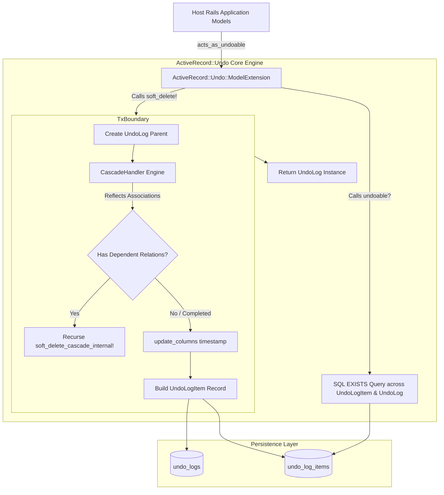
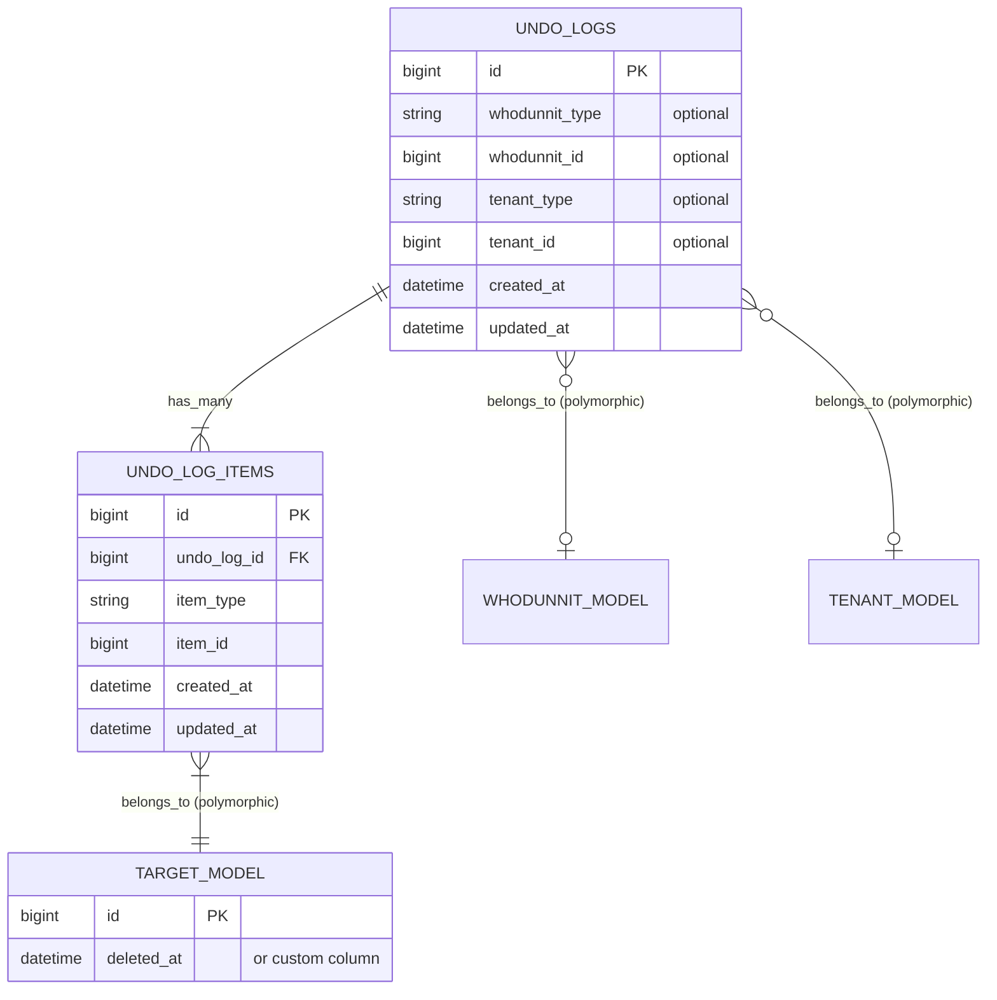
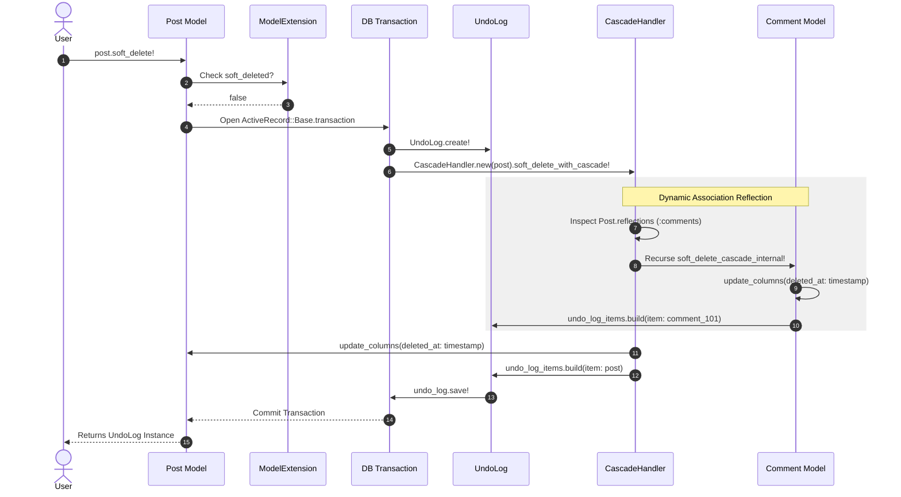
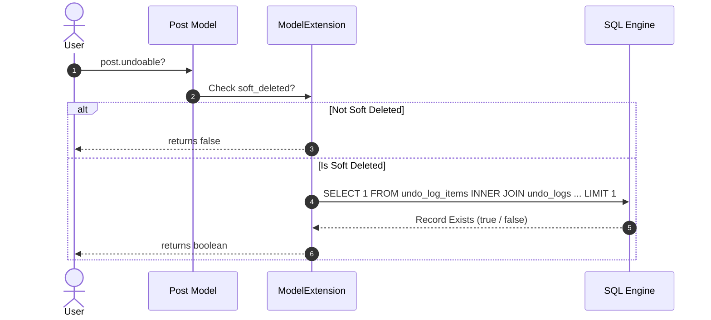
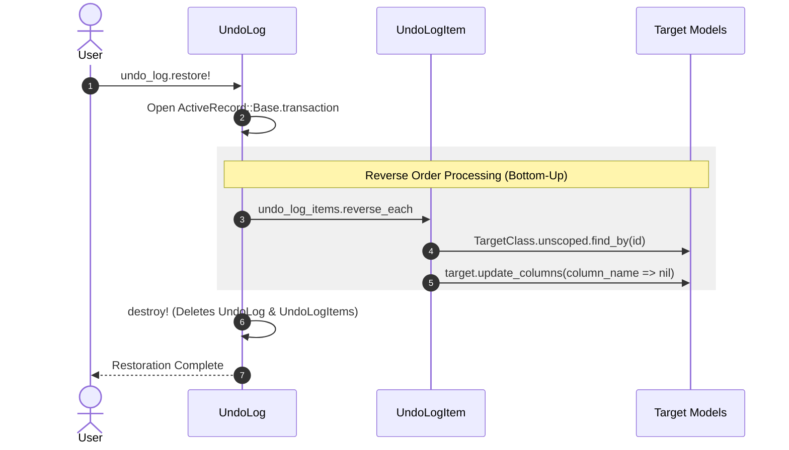

# ActiveRecord::Undo Architecture & Technical Documentation

`ActiveRecord::Undo` is a Rails Engine gem providing transactional, cascade-aware soft deletion and restoration capabilities for ActiveRecord models. It records state transitions into a dedicated polymorphic audit structure within single database transactions.

---

## 1. System Architecture Overview

---

## 2. Core Components & Responsibilities

### Component Summary

| Component                      | File Path                                                       | Class / Module       | Core Responsibility                                                                                                                    |
| :----------------------------- | :-------------------------------------------------------------- | :------------------- | :------------------------------------------------------------------------------------------------------------------------------------- |
| **Main Hook & Context**        | `lib/active_record/undo.rb`                                     | `ActiveRecord::Undo` | Hooks into `ActiveSupport.on_load(:active_record)`, manages ambient thread context (`whodunnit`, `current_tenant`), and defines errors |
| **Model Extension**            | `lib/active_record/undo/model_extension.rb`                     | `ModelExtension`     | Injects DSL (`acts_as_undoable`), scopes (`kept`, `soft_deleted`), and methods (`soft_delete!`, `undoable?`, `restore!`)               |
| **Model Attribution Helper**   | `lib/active_record/undo/model_extension/attribution_helper.rb`  | `AttributionHelper`  | Resolves user attribution and tenant context from parameters, configured procs, or thread contexts                                     |
| **Tenant Verification**        | `lib/active_record/undo/model_extension/tenant_verification.rb` | `TenantVerification` | Validates initiating context against log tenant on `#restore!`, raising `SecurityError` on mismatch                                    |
| **Cascade Engine**             | `lib/active_record/undo/cascade_handler.rb`                     | `CascadeHandler`     | Inspects ActiveRecord reflections (`reflections`) and executes DFS traversal                                                           |
| **Cascade Association Finder** | `lib/active_record/undo/cascade_handler/association_finder.rb`  | `AssociationFinder`  | Resolves which records should cascade based on dependency configuration                                                                |
| **Cascade Record Updater**     | `lib/active_record/undo/cascade_handler/record_updater.rb`      | `RecordUpdater`      | Updates the database timestamps directly bypassing callbacks                                                                           |
| **Audit Log Parent**           | `lib/active_record/undo/undo_log.rb`                            | `UndoLog`            | Represents the top-level deletion event and manages atomic batch restoration, tenancy, and user attribution                            |
| **Audit Log Child**            | `lib/active_record/undo/undo_log_item.rb`                       | `UndoLogItem`        | Maps polymorphic targets (`item_type`, `item_id`) to original deleted entities                                                         |
| **Engine Link**                | `lib/active_record/undo/engine.rb`                              | `Engine`             | Appends `db/migrate/` directly to host app migration paths                                                                             |
| **Configuration**              | `lib/active_record/undo/configuration.rb`                       | `Configuration`      | Houses retention_period, current_user_method, and current_tenant_method settings                                                       |
| **Purger Service**             | `lib/active_record/undo/purger.rb`                              | `Purger`                | Deletes expired UndoLog/Items and soft-deleted model records in batches, scoped to tenant context when present                         |
| **Purger Reflection Helper**   | `lib/active_record/undo/purger/reflection_helper.rb`            | `ReflectionHelper`      | Determines cascade and nullify reflection behavior for purge routines                                                                  |
| **Purge Job**                  | `lib/active_record/undo/purge_job.rb`                           | `PurgeJob`              | ActiveJob background runner invoking Purger                                                                                            |
| **Rake Task**                  | `lib/active_record/undo/tasks/purge.rake`                       | Rake Task               | Exposes `active_record_undo:purge_expired` command                                                                                     |
| **Mountable Engine**           | `lib/active_record/undo/engine.rb`                              | `Engine`                | Defines mountable Rails engine route namespace, view helper hooks, and migrations                                                      |
| **Open-Redirect Guard**        | `lib/active_record/undo/safe_redirect.rb`                       | `SafeRedirect`          | Enforces URL safety, same-host/port validation, CRLF blocking, and safe fallback paths                                                 |
| **View Helpers**               | `lib/active_record/undo/view_helpers.rb`                        | `ViewHelpers`           | Provides `undo_button_to` and `undo_link_to` helpers with automatic model and signed token resolution                                  |
| **Engine Base Controller**     | `app/controllers/active_record/undo/application_controller.rb`  | `ApplicationController` | Base engine controller handling CSRF, attribution, tenancy, and multi-format error responses                                           |
| **HTTP Restoration Endpoints** | `app/controllers/active_record/undo/logs_controller.rb`         | `LogsController`        | Handles restore actions by ID or signed token for HTML, Turbo Stream, and JSON                                                         |
| **Signed Restore Endpoint**    | `app/controllers/active_record/undo/restores_controller.rb`     | `RestoresController`    | Dedicated route endpoint for signed token restorations (`POST /undo/restore/:token`)                                                  |

---

## 3. Data Model & Database Design

---

## 4. Sequence Diagrams

### Soft Deletion Flow (`#soft_delete!`)

### Restoration Verification Flow (`#undoable?`)

### Restoration Flow (`#restore!`)

---

## 5. Key Technical Considerations

1. **Depth-First Traversal Order:** Cascading deletes traverse downward to child records before updating the parent node. Child item associations are appended to `undo_log_items` first, and the parent record is appended last.
2. **Reverse Restoration Order:** `#restore!` calls `undo_log_items.reverse_each`. This ensures the parent node is restored first before restoring its dependent records, maintaining database relational integrity.
3. **Optimized `#undoable?` Query Execution:** Calling `#undoable?` executes a single optimized `EXISTS` query (`joins(:undo_log).exists?(item_type: self.class.name, item_id: id)`). This checks for the presence of both the audit item and the valid parent log without loading records into Ruby memory.
4. **Bypassing Callbacks:** Soft-deletion updates use `update_columns`. This executes a direct SQL `UPDATE` query without firing standard ActiveRecord persistence callbacks (`save`, `validate`), preventing unintended side effects during soft deletes.
5. **Unscoped Model Resolution:** `#restore_item!` uses `klass.unscoped.find_by(id: item_id)` to locate records. This guarantees records are retrieved even when models define default scopes that filter out soft-deleted records.
6. **Class Inheritance Security Check:** When constantizing stored class strings, the gem validates that target models inherit from `ActiveRecord::Base` to prevent arbitrary non-model constant manipulation.
7. **Tenant Matching Verification:** During `#restore!`, if `UndoLog` is associated with a tenant, the current tenant context is verified against the log's tenant before initiating restoration, raising `ActiveRecord::Undo::SecurityError` on mismatch to prevent cross-tenant data restores.
8. **User Attribution Transparency:** `#soft_delete!` and `#restore!` support transparent user tracking via explicit keyword arguments or ambient context resolution (`Current.user` / Thread context).
9. **Configured Context Enforcement:** When `current_user_method` or `current_tenant_method` is configured via `ActiveRecord::Undo.configure`, operations verify that the evaluated context is not `nil`. If any configured method evaluates to `nil`, `soft_delete!` and `restore!` immediately raise `ActiveRecord::Undo::SecurityError` to prevent unauthenticated or tenantless mutations.
10. **Cryptographic Restore Tokens & Single-Use Semantics:** `UndoLog#signed_token` and `ModelExtension#signed_token` generate HMAC-SHA256 signed tokens using Rails' `message_verifier(:active_record_undo)` (configured with `ActiveRecord::Undo.config.token_expires_in`). The token encapsulates the log's ID with a purpose lock (`purpose: :restore`) and timestamp expiration (`exp`). When verified via `UndoLog.find_by_signed_token`, any payload alteration, purpose mismatch, or expiration automatically invalidates the token. Furthermore, because `#restore!` destroys the `UndoLog` database record upon completion, tokens automatically provide single-use replay protection: once restored, subsequent attempts to verify the same token find no corresponding database record, resulting in a `404 Not Found`. Even with a cryptographically authentic token, tenant boundary validation (`TenantVerification`) remains strictly enforced during restoration to prevent cross-tenant attacks.

---

## 6. Method-by-Method Implementation Reference

### 6.1 `lib/active_record/undo.rb` (Entrypoint & Context)

* **`require 'active_record'` Loader Check**
  * *Function*: Safely imports ActiveRecord. If ActiveRecord is not in the load path, it catches the `LoadError` and throws a detailed error instructing the developer to add `activerecord` to their `Gemfile`.
* **Loader Hook Block**
  * *Function*: Detects if `ActiveSupport` is loaded:
    * If present, registers `ActiveSupport.on_load(:active_record)` to inject the extension module when ActiveRecord boots.
    * If absent (e.g. running in simple Ruby scripts), directly includes `ModelExtension` into `ActiveRecord::Base` as a fallback.
* **`whodunnit` / `whodunnit=`**
  * *Function*: Thread/Fiber-safe accessor for the active actor performing deletions or restorations.
* **`current_tenant` / `current_tenant=`**
  * *Function*: Thread/Fiber-safe accessor for the active tenant context.
* **`verify_configured_context!`**
  * *Function*: Enforces that configured `current_user_method` and `current_tenant_method` do not return `nil`. Raises `ActiveRecord::Undo::SecurityError` if any configured method evaluates to `nil`.
* **`SecurityError` Exception Class**
  * *Function*: Custom error inheriting from `ActiveRecord::Undo::Error`, raised when a cross-tenant restoration attempt, missing tenant context, or configured context violation occurs.

### 6.2 `lib/active_record/undo/engine.rb` (Rails Integration)

* **`initializer 'active_record_undo.migrations'`**
  * *Function*: Automatically runs on Rails boot to append the gem's engine migrations directory to the host application's migrations search paths. This allows host applications to detect and run gem database migrations without needing to manually copy them into the application's workspace.

### 6.3 `lib/active_record/undo/model_extension.rb` (Model Extension Module)

* **`acts_as_undoable(column: :deleted_at)`**
  * *Function*: Class-level DSL macro injected into models to enable soft-deletion.
  * *Details*: Defines class-level configurations:
    * `undoable_column`: Caches the name of the column (defaults to `:deleted_at`).
    * `kept` scope: Returns records that are not soft-deleted (`where(column => nil)`).
    * `soft_deleted` scope: Returns records that are soft-deleted (`where.not(column => nil)`).
    * `expired` scope: Returns records soft-deleted before the global retention period threshold.
* **`soft_deleted?`**
  * *Function*: Checks if the current record instance has been soft-deleted. Returns `true` if the configured deletion column is populated with a timestamp.
* **`undoable?`**
  * *Function*: Checks if the soft-deleted record has a valid undo log entry available for restoration.
  * *Steps*:
    1. Returns `false` immediately if `soft_deleted?` is `false`.
    2. Performs a lightweight SQL `EXISTS` query (`ActiveRecord::Undo::UndoLogItem.joins(:undo_log).exists?(item_type: self.class.name, item_id: id)`).
    3. Returns `true` if both the log item and its parent `UndoLog` exist in the database.
* **`undo_log` / `latest_undo_log`**
  * *Function*: Resolves the latest `UndoLog` audit record recording the soft deletion of this model instance via `find_latest_undo_log_item`. Returns `nil` if not soft-deleted or already purged/restored.
* **`signed_token(expires_in: ...)` / `to_signed_token`**
  * *Function*: Generates a cryptographic signed token using Rails' message verifier directly from the model instance for secure direct-link restorations.
* **`soft_delete!(whodunnit: nil, tenant: nil)`**
  * *Function*: Starts the cascade soft-deletion sequence for the record.
  * *Parameters*:
    * `whodunnit`: User/Actor executing the delete (falls back to `current_user_method` or Thread/Fiber context).
    * `tenant`: Tenant context (falls back to `current_tenant_method`, Thread/Fiber context, or record's tenant association).
  * *Steps*:
    1. Calls `ensure_undoable_column_exists!` to verify the database column is present.
    2. Aborts and returns `false` if the record is already soft-deleted.
    3. Invokes `ActiveRecord::Undo.verify_configured_context!` to enforce that configured context methods do not evaluate to `nil`.
    4. Resolves user and tenant attributes via `AttributionHelper`.
    5. Opens an ActiveRecord database transaction block, creates a parent `UndoLog`, and cascades deletion via `CascadeHandler`.
* **`restore!(whodunnit: nil)`**
  * *Function*: Restores the record from its soft-deleted state.
  * *Parameters*:
    * `whodunnit`: User/Actor executing the restore.
  * *Steps*:
    1. Verifies column presence via `ensure_undoable_column_exists!`.
    2. Aborts and returns `false` if the record is not soft-deleted.
    3. Invokes `ActiveRecord::Undo.verify_configured_context!` to enforce that configured context methods do not evaluate to `nil`.
    4. Resolves the latest `UndoLogItem` that records the soft-deletion of this instance.
    5. If a log item is found, verifies that the current tenant context matches the log's tenant via `TenantVerification` (raises `ActiveRecord::Undo::SecurityError` if mismatched).
    6. Attributes the restoration transaction context to `whodunnit`.
    7. Calls `restore!` on the parent `UndoLog` (which restores the entire deleted tree).
    8. If no log item is found, it falls back to a simple, direct restore by setting the deletion column back to `nil`.
    9. Automatically reloads the instance attributes in-memory (using `reload`) to refresh the model state before returning `true`.
* **`ensure_undoable_column_exists!` (Private)**
  * *Function*: Asserts that the configured soft-delete column exists in the database schema table. Raises `ActiveRecord::Undo::Error` if missing.
* **`find_latest_undo_log_item` (Private)**
  * *Function*: Queries `UndoLogItem` records pointing to this record, ordering by `created_at DESC` to find the most recent deletion event.
* **`soft_delete_cascade_internal!(timestamp, undo_log)` (Private)**
  * *Function*: Wraps instantiation and invocation of `CascadeHandler` to encapsulate cascade traversal.

### 6.4 `lib/active_record/undo/model_extension/attribution_helper.rb` (Attribution Helper)

* **`resolve_whodunnit(whodunnit)` (Private)**
  * *Function*: Resolves the actor executing the action in priority order: explicit parameter -> `config.current_user_method.call` -> `ActiveRecord::Undo.whodunnit` -> `nil`.
* **`resolve_tenant(tenant)` (Private)**
  * *Function*: Resolves the tenant context in priority order: explicit parameter -> `config.current_tenant_method.call` -> `ActiveRecord::Undo.current_tenant` -> model instance `tenant` association -> `nil`.
* **`build_undo_log_attributes(whodunnit, tenant)` (Private)**
  * *Function*: Builds attributes hash supporting polymorphic model instances and scalar IDs for both actor and tenant.

### 6.5 `lib/active_record/undo/model_extension/tenant_verification.rb` (Tenant Verification)

* **`verify_tenant_match!(undo_log)` (Private)**
  * *Function*: Asserts that the initiating context's tenant matches the log's tenant before restoration. Raises `ActiveRecord::Undo::SecurityError` if the context tenant is missing or mismatched.
* **`tenant_matches?(undo_log, ctx)` (Private)**
  * *Function*: Compares `undo_log` tenant type/id against active context, supporting polymorphic model instances and raw scalar identifiers.

### 6.6 `lib/active_record/undo/cascade_handler.rb` (Cascade Execution)

* **`initialize(record)`**
  * *Function*: Caches the record instance to be cascade deleted.
* **`soft_delete_with_cascade!(timestamp, undo_log)`**
  * *Function*: Coordinates the cascade deletion of the current record.
  * *Steps*:
    1. Invokes `#cascade_to_associations!` to recurse into child tables.
    2. Invokes `#update_record_timestamps!` to mark the current record as soft-deleted.
    3. Appends an `UndoLogItem` pointing to this record to the `UndoLog` transaction.
* **`cascade_to_associations!(timestamp, undo_log)` (Private)**
  * *Function*: Iterates over reflections retrieved by `AssociationFinder`, fetches their records, and calls `#cascade_to_record!` on each associated record.
* **`cascade_to_record!(associated, reflection, timestamp, undo_log)` (Private)**
  * *Function*: Handles deletion of a single associated child record:
    * Excludes it if it is already soft-deleted.
    * If the child model is also configured with `acts_as_undoable`, calls its private `#soft_delete_cascade_internal!` recursively.
    * If it is not undoable, but configured with `dependent: :destroy`, it invokes `#destroy!` to perform a hard-deletion.

### 6.7 `lib/active_record/undo/cascade_handler/association_finder.rb` (Reflections Finder)

* **`associations_to_cascade` (Private)**
  * *Function*: Reflects on the model's association metadata and filters list of associations to select only those configured with `dependent: :destroy`, `dependent: :soft_delete`, or `dependent: :delete_all`.
* **`associated_records_for(reflection)` (Private)**
  * *Function*: Fetches associated target records. Normalizes single relations and collection associations (like `has_many`) into a flat array structure.

### 6.8 `lib/active_record/undo/cascade_handler/record_updater.rb` (Timestamps Updater)

* **`update_record_timestamps!(timestamp)` (Private)**
  * *Function*: Bypasses ActiveRecord validations, callbacks, and dirty checking to directly write updates for the soft-delete column and `updated_at` timestamps using database-level `update_columns`.

### 6.9 `lib/active_record/undo/undo_log.rb` (Batch Restoration)

* **`restore!(whodunnit: nil)`**
  * *Function*: Triggers database restoration of the entire tree recorded under this log.
  * *Steps*:
    1. Invokes `ActiveRecord::Undo.verify_configured_context!` to enforce that configured context methods do not evaluate to `nil`.
    2. Enforces tenant verification if tenant association is present on the log.
    3. Resolves `whodunnit` actor context.
    4. Opens a database transaction block.
    5. Iterates over associated `undo_log_items` in *reverse order* (`reverse_each`), guaranteeing parent records are restored before child records.
    6. Invokes `#restore_item!` on each item.
    7. Automatically calls `#destroy!` on completion to purge the audit records (`UndoLog` and nested `UndoLogItem` rows) from the database.
* **`expired?`**
  * *Function*: Checks whether `created_at` timestamp is older than `ActiveRecord::Undo.config.retention_period`.
* **`signed_token(expires_in: ActiveRecord::Undo.config.token_expires_in, purpose: :restore)` / `to_signed_token`**
  * *Function*: Generates a cryptographically signed, URL-safe token representing this `UndoLog` for direct link restorations.
  * *Details*: Employs `self.class.token_verifier.generate(id, purpose: purpose, expires_in: expires_in)`.
* **`.find_by_signed_token(token, purpose: :restore)`**
  * *Function*: Verifies the cryptographic token signature and fetches the matching `UndoLog` database record.
  * *Details*: Returns `nil` if the token is blank, expired, tampered with, has a mismatched purpose, or if the underlying `UndoLog` record no longer exists in the database.
* **`.verify_signed_token(token, purpose: :restore)`**
  * *Function*: Decodes and verifies the token payload via `token_verifier.verified(token, purpose: purpose)`. Catches `ActiveSupport::MessageVerifier::InvalidSignature` and returns `nil` on tampering or expiration.
* **`.token_verifier`**
  * *Function*: Provides the `ActiveSupport::MessageVerifier` instance used for token generation and verification. In Rails environments, utilizes `Rails.application.message_verifier(:active_record_undo)`. In standalone environments, falls back to an SHA256 verifier keyed to `ActiveRecord::Undo.config.token_secret_key`.
* **`.for_whodunnit(user)`**
  * *Function*: Scopes logs to those deleted by a specific user/actor. Supports both model instances and raw IDs.
* **`.for_tenant(tenant)`**
  * *Function*: Scopes logs to those belonging to a specific tenant. Supports both model instances and raw IDs.

### 6.10 `lib/active_record/undo/undo_log_item.rb` (Item Restoration)

* **`restore_item!`**
  * *Function*: Performs restoration of the individual record referenced by the audit log item.
  * *Steps*:
    1. Resolves model class via `#resolve_model_class`.
    2. Resolves target record using `unscoped.find_by(id: item_id)` (unscoping ignores default scopes filtering soft-deleted records).
    3. Ensures the soft-delete column exists on the model table.
    4. Resets the soft-delete column to `nil` using `#reset_soft_delete_column!`.
* **`resolve_model_class` (Private)**
  * *Function*: Constantizes the stored `item_type` string.
  * *Security*: Asserts that the constant is a valid class that inherits from `ActiveRecord::Base`. Raises `ActiveRecord::Undo::Error` if constantization fails or targets non-model classes.
* **`ensure_column_exists!(klass, column_name)` (Private)**
  * *Function*: Confirms that the target soft-delete column exists in the class's table schema. Throws `ActiveRecord::Undo::Error` if missing.
* **`reset_soft_delete_column!(target, column_name)` (Private)**
  * *Function*: Bypasses standard callbacks and validations to write a `nil` value to the soft-delete column directly in the database.

### 6.11 `lib/active_record/undo/configuration.rb` (Global Configuration)

* **`Configuration#initialize`**
  * *Function*: Instantiates default configurations for the gem.
  * *Details*:
    * `@retention_period`: Defaults to `30.days`.
    * `@current_user_method`: Defaults to `nil`. Callable proc to resolve the current user/actor.
    * `@current_tenant_method`: Defaults to `nil`. Callable proc to resolve the current tenant.
    * `@base_controller`: Defaults to `"::ApplicationController"`. Base controller for engine authentication and authorization hooks.
    * `@default_redirect_path`: Defaults to lambda resolving `main_app.root_path` (falling back to `'/'`).
    * `@token_expires_in`: Defaults to `24.hours`. Lifespan for signed direct-link restore tokens.
    * `@token_secret_key`: Defaults to `nil` (uses Rails application verifier).
    * `@error_handling`: Defaults to `:auto`. Controls whether HTML requests redirect on error or render status codes.

### 6.12 `lib/active_record/undo/purger.rb` (Hard Purging Engine)

* **`Purger.purge_expired!(batch_size: 1000)`**
  * *Function*: Cleans up all database records and logs that are past their retention limits.
  * *Steps*:
    1. Delegates to `purge_expired_logs!(batch_size)` to find and clean up expired `UndoLog` and `UndoLogItem` entries in batches using direct SQL `delete_all` execution.
    2. Delegates to `purge_expired_records!(batch_size)` to eager-load the host Rails application models (preventing Zeitwerk lazy-load gaps), identify expired records via the `.expired` scope, and hard-delete them and their cascading dependent associations in batches.
  * *Relational Integrity & Constraint Protection*: Bottom-up recursive cascading deletes are performed first for associations marked as `:destroy`, `:delete_all`, or `:soft_delete`. For `:nullify` configurations, foreign key values are updated to `nil`, falling back to cascading deletion if the column contains a database-level `NOT NULL` constraint.

### 6.13 `lib/active_record/undo/purger/reflection_helper.rb` (Purger Reflection Helper)

* **`nullify_reflections(model)` (Private)**
  * *Function*: Filters model reflections for `:has_many` or `:has_one` associations configured with `dependent: :nullify` where foreign key is nullable.
* **`cascade_reflections(model)` (Private)**
  * *Function*: Filters model reflections for associations requiring cascade deletion (`:destroy`, `:delete_all`, `:soft_delete`, or non-nullable `:nullify`).
* **`foreign_key_nullable?(ref)` (Private)**
  * *Function*: Checks table column schema to determine if the foreign key column allows null values.

### 6.14 `lib/active_record/undo/purge_job.rb` (Background Task Worker)

* **`PurgeJob#perform(batch_size: 1000)`**
  * *Function*: Runs inside ActiveJob (when available) to execute purging asynchronously.
  * *Details*: Invokes `ActiveRecord::Undo::Purger.purge_expired!(batch_size: batch_size)`.

### 6.15 `lib/active_record/undo/tasks/purge.rake` (Command Line Utility)

* **`active_record_undo:purge_expired`**
  * *Function*: Exposes CLI Rake task for the purger engine.
  * *Details*: Checks `ENV['BATCH_SIZE']` for custom batch sizes, falling back to 1000, and triggers `ActiveRecord::Undo::Purger.purge_expired!`.

### 6.16 `lib/active_record/undo/engine.rb` (Mountable Rails Engine)

* **`ActiveRecord::Undo::Engine`**
  * *Function*: Rails engine that defines isolated namespace `ActiveRecord::Undo` and mounts routes.
  * *Details*:
    * Automatically hooks view helpers into ActionView via `ActiveSupport.on_load(:action_view)`.
    * Registers `:turbo_stream` MIME type (`text/vnd.turbo-stream.html`) when not already defined.
    * Appends gem migrations to host app's migration paths.

### 6.17 `lib/active_record/undo/safe_redirect.rb` (Open-Redirect Prevention)

* **`determine_redirect_path` (Private)**
  * *Function*: Determines safe target path in priority: validated `params[:redirect_to]`, validated `request.referer`, or `resolve_fallback_path`.
* **`safe_redirect_path(path)` (Private)**
  * *Function*: Validates URL to strictly allow relative paths or same-host/port absolute URLs, preventing open redirect vulnerabilities. Automatically rejects CRLF characters (`\r`, `\n`) and non-HTTP/HTTPS schemes (e.g. `javascript:`, `data:`).

### 6.18 `lib/active_record/undo/view_helpers.rb` (ERB View Helpers)

* **`undo_button_to(target, text = nil, signed: false, **html_options)`**
  * *Function*: Renders a `button_to` form targeting `active_record_undo.restore_log_path` or `signed_restore_path`.
* **`undo_link_to(target, text = nil, signed: false, **html_options)`**
  * *Function*: Renders an anchor tag configured with `data: { turbo_method: :post }` for Turbo and UJS compatibility.
* **`extract_log_target(target)` (Private)**
  * *Function*: Safely extracts the target `UndoLog`. When passed an ActiveRecord model, verifies that the model is soft-deleted and has an associated undo log, raising `ArgumentError` if active or unpersisted to prevent erroneous routing with the model's primary key.

### 6.19 `app/controllers/active_record/undo/application_controller.rb` (Engine Base Controller)

* **`ApplicationController`**
  * *Function*: Inherits from `ActiveRecord::Undo.base_controller_class` with CSRF protection enabled.
  * *Details*: Handles tenant resolution, whodunnit resolution, open redirect verification, and graceful error responses (HTML, Turbo Stream, JSON).

### 6.20 `app/controllers/active_record/undo/logs_controller.rb` & `restores_controller.rb` (HTTP Endpoints)

* **`LogsController#restore`**
  * *Function*: Finds undo log by ID or signed token, checks expiration and permissions, executes restoration, and returns format-specific response (emitting `303 See Other` on HTML redirect for Turbo Drive compatibility).
* **`LogsController#find_undo_log` (Private)**
  * *Function*: Resolves the target `UndoLog` from request parameters. If `params[:token]` is present, calls `UndoLog.find_by_signed_token(params[:token])`. If `params[:id]` is present, delegates to `find_by_id_or_token`.
* **`LogsController#find_by_id_or_token(identifier)` (Private)**
  * *Function*: Dual-lookup resolver. If `identifier` consists purely of numeric digits or matches a UUID format, fetches via `UndoLog.find_by(id: identifier)`. For all other string formats, safely routes to `UndoLog.find_by_signed_token(identifier)` without triggering database type exceptions.
* **`LogsController#execute_restore_action` (Private)**
  * *Function*: Wraps `@undo_log.restore!(whodunnit: resolve_whodunnit_user)` inside tenant context (`with_tenant_context`) to enforce multi-tenant security during restoration.
* **`RestoresController#create`**
  * *Function*: Dedicated HTTP endpoint for signed token restorations (`POST /undo/restore/:token`). Inherits from `LogsController` and executes `#restore`.
